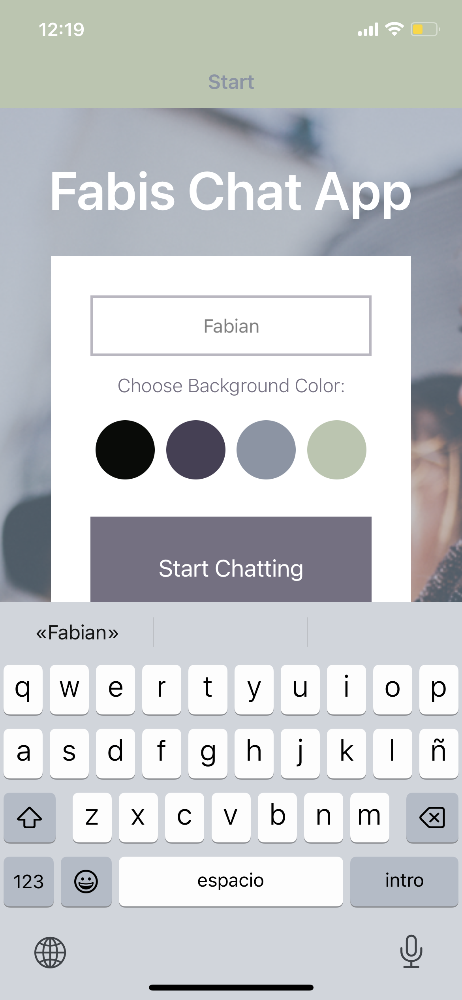
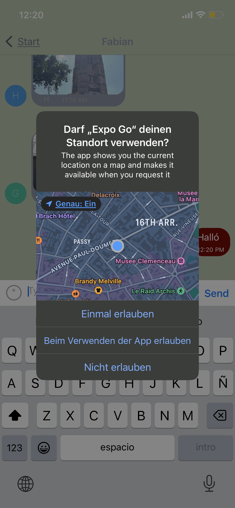
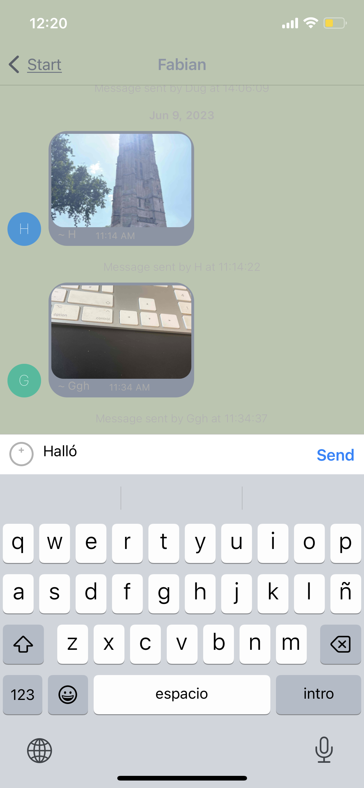
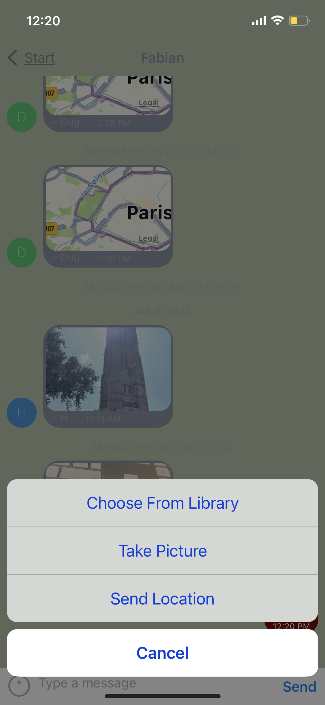
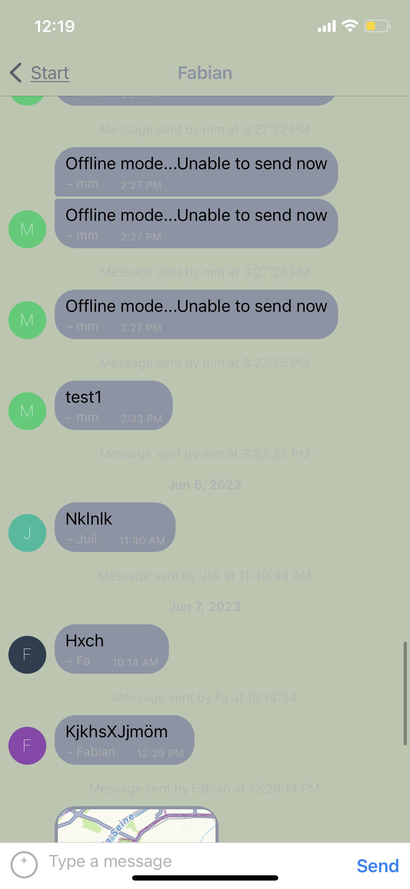

# Chat-App

## Description

This is a chat application built with React Native that allows users to send and receive messages in real-time. It utilizes the react-native-gifted-chat library for the chat interface and integrates with Firebase Firestore for message storage and retrieval.

## How to run locally

Clone the Repository: git clone https://github.com/FabiMi/chat-app/tree/main
Install the dependencies:
Make sure you have Node.js and npm (Node Package Manager) installed on your system.
Open your project directory in a terminal or command prompt.
Run npm install with the required dependencies.
Set up Firebase Firestore:
Create a Firebase project and enable Firestore.
Get the Firebase configuration values (apiKey, authDomain, projectId, etc.).
Replace the placeholder values in the Firebase configuration section of the code with your own values.
Install ExpoGo and run the App with it:
Install the Expo Go app on your device from the App Store or Google Play.
Scan the QR code generated by expo start using the Expo Go app.
The app will launch on your device or emulator.

## Technologies used:

HTML
CSS
React Native
Firebase Firestore
Expo Go

## Features
Sending and receiving messages in real-time
Customizable chat bubble styles
System log messages for tracking message timestamps
Caching of messages using AsyncStorage
Integration with Firebase Firestore for data storage
Custom actions for sending images and location sharing
Support for displaying maps for location messages

